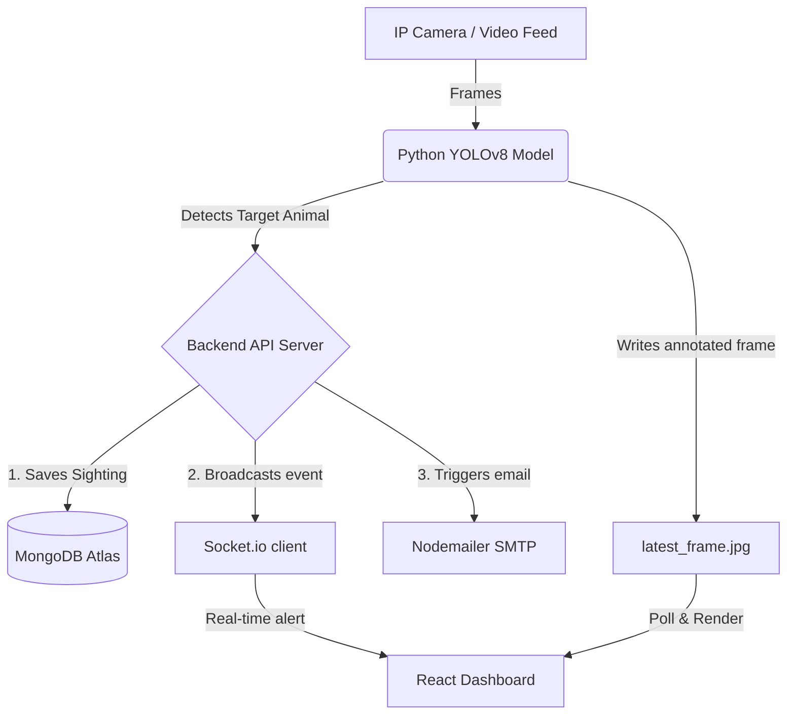

# 🐾 WildEye - AI-Powered Wildlife Monitoring System

[](https://ultralytics.com)
[](https://react.dev)
[](https://nodejs.org)
[](https://mongodb.com)
[](https://nodemailer.com)

**WildEye** is a real-time, AI-powered wildlife monitoring and early warning system designed to mitigate human-wildlife conflicts. By employing state-of-the-art computer vision (`YOLOv8`) and a synchronized web stack, the system identifies dangerous/endangered animals, logs sightings, and instantly alerts field rangers via email dispatch.

---

## 🌟 Key Features

* **Real-Time AI Animal Detection**: Custom-trained `YOLOv8` computer vision pipeline detecting target species (elephants, bears, leopards, tigers, etc.) with configurable confidence thresholds.
* **Live Camera Stream**: Smooth, low-latency live camera streaming directly on the dashboard.
* **Secured JWT Admin Portal**: Protected control panel featuring a modern login/signup layer using JSON Web Tokens (JWT) and `bcryptjs` password hashing.
* **Automated Dispatch System**: Nodemailer-driven SMTP engine that emails instant alerts to enabled forest officers upon high-confidence detections.
* **Dynamic Analytics & Custom Reports**: Automatically compiles historical database entries into dynamic overview statistics (Total Detections, threatened species ratio, active hours) and exports daily, weekly, or monthly logs.

---

## ⚙️ System Flow



---

## 📊 Dataset

We trained our YOLOv8 model using a custom dataset hosted on Roboflow Universe:

[](https://universe.roboflow.com/tejas-eurut/animal-detection-85p4k-qmaea)

### How to Download the Dataset
If you want to retrain the model locally, install the Roboflow Python package:
```bash
pip install roboflow
```

Then download the dataset in YOLOv8 format:
```python
from roboflow import Roboflow
rf = Roboflow(api_key="YOUR_ROBOFLOW_API_KEY")
project = rf.workspace("tejas-eurut").project("animal-detection-85p4k-qmaea")
version = project.version(2)
dataset = version.download("yolov8")
```

---

## 📂 Project Structure

```
WildEye_Project(EDI)/
├── ML_model/
│   ├── wildeye_test.py       # YOLOv8 target detection and frame streaming script
│   └── yolov8n.pt            # Pre-trained model weights
├── backend/
│   ├── server.js             # Node.js / Express API & Socket.io server
│   └── .env                  # Port, database URL, and SMTP key parameters
└── frontend/
    ├── src/
    │   ├── components/       # App pages: Home, LiveMonitor, Reports, Settings, Login
    │   ├── App.js            # Stateful JWT routes & path guards
    │   └── index.js          # React entry point
    └── package.json          # React libraries
```

---

## 🛠️ Setup & Installation

### Prerequisites
* **Node.js** (v16+)
* **Python** (3.8+)
* **MongoDB Atlas** account (or local MongoDB database)

---

### Step 1: Backend Setup
1. Navigate to the parent directory containing the backend dependencies:
   ```bash
   cd backend
   ```
2. Create or open the `.env` file and configure your credentials:
   ```env
   DATABASE_URL=mongodb+srv://<username>:<password>@cluster.mongodb.net/WildeyeDB?retryWrites=true&w=majority
   EMAIL_USER=your_gmail@gmail.com
   EMAIL_PASS=your_16_character_app_password
   JWT_SECRET=your_secure_jwt_secret_key
   ```
   *Note: For `EMAIL_PASS`, you must generate a 16-character [Google App Password](https://myaccount.google.com/apppasswords).*

---

### Step 2: Frontend Setup
1. Navigate to the frontend directory:
   ```bash
   cd ../frontend
   ```
2. Install the frontend dependencies:
   ```bash
   npm install
   ```

---

### Step 3: Machine Learning Model Setup
1. Install Ultralytics YOLOv8, OpenCV, and Requests:
   ```bash
   pip install ultralytics opencv-python requests numpy
   ```
2. Open `ML_model/wildeye_test.py` and verify these paths match your files:
   * `video_path`: Path to your input video feed or camera device index.
   * `model_path`: Path to your trained weights (`best.pt`).

---

## 🚀 Running the System

Open **three separate terminal instances** to run the complete WildEye pipeline:

### 1. Launch the Backend Server
```bash
cd backend
node server.js
```
*Console output should show:* `SUCCESS: Successfully connected to MongoDB Atlas!`

### 2. Launch the React Web Portal
```bash
cd frontend
npm start
```
*This will open the web interface at [http://localhost:3000](http://localhost:3000).*

### 3. Start the Object Detection Loop
```bash
cd ML_model
python wildeye_test.py
```
*A local OpenCV window will launch displaying the annotated video. Detections will instantly print to the backend and update the web portal.*

---

## 🔒 Security & Roles
* **Admins/Control Room Operators**: Register an account on the sign-up screen, log in, and monitor sightings, customize active forest officer notifications, and download analytics.
* **Field Officers**: Registered inside **Settings**. They do not need to register accounts or access the dashboard. The system automatically routes instant alerts to their registered email addresses.

---

## 📄 License
This project is licensed under the MIT License - see the LICENSE file for details.